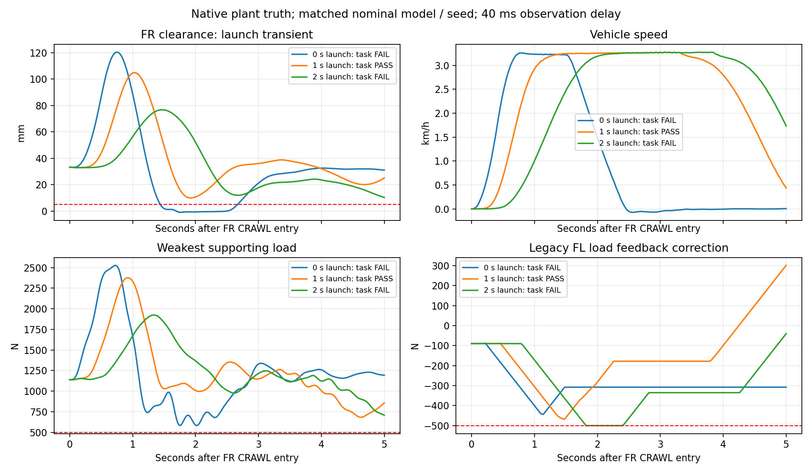

# 反馈延迟与 FR 异常恢复（2026-10-04）

## 实现范围

沿用固定质量、载荷位置及横向运动学表缩放0的独立 I_I 仿真副本。经典前馈、轮载反馈、支撑约束分配、姿态阻尼、速度PI和方向反馈继续工作，没有修改车辆参数、稳定或净空门槛。

新增 `--feedback-delay-s`，默认0，正延迟须同时启用 `--measurement-noise`。全部导出观测通道按20 ms生成延迟包，包括无噪声的接地点、CoM、净空、行程和角速度。取不晚于当前时间减延迟的最近包；启动历史不足时保持第一包。控制器时间戳仍为当前时间，独立验收始终使用当前plant truth。日志增加 `measurement_time_s` / `measurement_age_s`；非整周期延迟按采样量化，零延迟保持原噪声行为。

40 ms是压力试验设置，不是测得的传感器参数。本轮验证两个40 ms工况，不证明任意0–40 ms全区间、更大延迟或其他车型。

## 发现的问题与修正

1. FR速度目标直接从0跳到3.4 km/h，40 ms延迟下起步引起明显瞬态运动。29.88 s触发已有5 mm坑前/坑沿净空保护，当时真实净空约1.91 mm。静止抬轮和5 s保持已通过，但过坑失败。
2. 采用现有五次平滑速度参考，2 s起步完成双轮过坑，却出现约0.60 s的FR轮载反馈饱和，超过已有0.5 s验收线，仍FAIL。
3. 1 s平滑起步在标称和低附着/近起点两工况全循环PASS，FR持续反馈饱和均为0。没有扩大力限或放宽验收。显式指定 `--front-accel-ramp-s 1`，默认基线保留。
4. 原FR `ABORT_STOP`只制动，不能进入落轮恢复。新增固地停车恢复：FR和RR均须在坑前或坑后，离坑沿至少既有0.3 m；三支撑正载、CoM/准静态ZMP达到已有恢复裕度，停车后连续1 s才进入LOWERING。进入异常清除正常STOP计时，条件失效重新计时。坑上不满足几何条件时保持中止等待，坑上驶出/救援策略尚未完成。

## 原生结果

标称seed20261001；μ0.6/起点前移0.3 m为seed20261005，各自使用匹配辨识文件。

| 工况 | 延迟 / FR起步 | 任务 | 周期 s | RR横滚 ° | RR最弱支撑 N | RR最小ZMP λ | RR坑上净空 mm | 共用路径最大横移 cm |
|---|---|---|---:|---:|---:|---:|---:|---:|
| 标称旧基线 | 0 ms / 0 s | PASS | 87.52 | 9.10 | 777 | 0.05827 | 48.06 | 2.19 |
| 标称压力试验 | 40 ms / 0 s | FAIL，FR中止 | — | — | — | — | — | 2.22，仅FR运动 |
| 标称慢起步 | 40 ms / 2 s | FAIL，持续饱和 | 88.30，动作完成 | 9.27 | 762 | 0.05717 | 46.18 | 2.05 |
| 标称调整后 | 40 ms / 1 s | PASS | 87.92 | 9.24 | 762 | 0.05715 | 45.45 | 2.59 |
| μ0.6近起点旧基线 | 0 ms / 0 s | PASS | 86.58 | 8.90 | 786 | 0.05893 | 43.24 | 2.73 |
| μ0.6近起点调整后 | 40 ms / 1 s | PASS | 86.86 | 9.10 | 752 | 0.05640 | 42.45 | 2.09 |

此次提高延迟适应性，周期比各自零延迟基线增加约0.28–0.40 s。RR横滚更大、支撑裕度更小，不能称所有指标改善。FR坑上最低净空36.21/34.65 mm，运动段最低三支撑674/705 N，坑内速度约3.09–3.28 km/h；每轮保持≥5 s、停车、落轮和四轮恢复均通过。



三曲线使用相同车型、工况、噪声和40 ms延迟，各自按FR CRAWL起点对齐。0 s曲线来自恢复修复后的故障复核，触发后已制动/恢复；2 s失败原因为持续反馈饱和。5 mm线只标示坑前/坑沿门槛，不代表所有阶段统一净空门槛。

## FR异常恢复

相同40 ms/0 s起步再次产生真实净空故障：任务FAIL、恢复PASS。29.88 s中止，31.86 s在坑前停稳后落轮，49.86 s结束恢复观察。悬架力交接跳变0 N，之后最大单20 ms记录变化42.03 N，恢复四轮；RR循环未开始。完整入口在FR失败但恢复后终止，不再空跑至180 s。见[恢复证据](../evidence/static_fr_ii/front_delay_recovery_20261004.json)。

原生复核进入异常时没有正常STOP历史计时；审查发现的计时继承问题另以回归测试修复。此结果不覆盖坑上、支撑轮丢载或任意异常恢复。

## 复现

```powershell
$env:PYTHONPATH='src'
python scripts/run_right_side_full_cycle.py --output runs/delay40_recheck --efficiency-profile compact --lateral-ride-scale 0 --rear-control-profile robust --front-steering-feedback --front-target-speed-kph 3.4 --front-min-pit-speed-kph 3 --front-accel-ramp-s 1 --front-brake-lead-m 0.5 --rear-target-speed-kph 3.35 --rear-min-pit-speed-kph 3 --measurement-noise --noise-seed 20261001 --average-path-reference --support-allocation active --support-allocation-transitions --support-allocation-gains evidence/static_fr_ii/support_allocation_gains_20261003.json --feedback-delay-s 0.04
```

低附着复核换seed20261005，加 `--road-friction 0.6 --vehicle-start-offset-m 0.3`，增益换为 `evidence/static_fr_ii/support_gains_mu06_close_20261004.json`。恢复复核去掉1 s起步参数，然后执行 `python scripts/summarize_front_recovery.py runs/该轮目录 --output runs/该轮目录/front_recovery_report.json`。

[精简证据](../evidence/static_fr_ii/feedback_delay_validation_20261004.json)保留成功、失败、配置、模型哈希及分阶段时间。完整runs留在本机。控制周期20 ms、TruckSim步长0.5 ms不变。

后续先验证有限执行器力偏差下的反馈恢复，补卸载初中段局部模型。当前RR最小λ约0.0564，接近0.05，先增加稳定裕度，再考虑提速/压缩时间。更大延迟、坑上异常、4–7 km/h和其他车型/载荷尚未验证。
