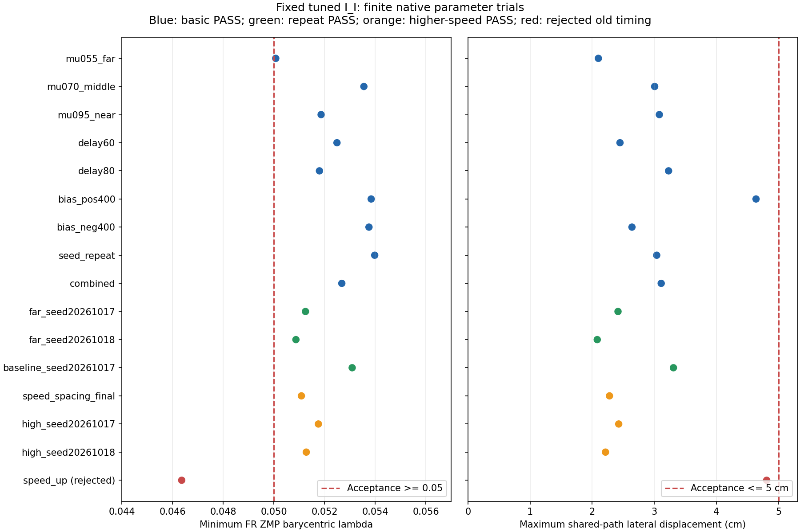

# 参数鲁棒性强化验证（2026-10-05）

## 目标和范围

在同一个独立调参的I_I副本上，检查FR→RR抬轮、三轮过坑、停车、落轮全过程。保持车辆质量、载荷位置、悬架模型、0.5 ms原生步长和20 ms控制周期固定；采用经典专家反馈和支撑QP。没有重建plant、引入RL或把增益复用称为重新辨识。

扰动包括摩擦系数0.55/0.60/0.70/0.95、车辆起点偏移−0.2/+0.15/+0.3/+0.4 m、持续反馈延迟40/60/80 ms、不同噪声种子，以及RR保持段FL执行器输出±400 N偏差。另有μ0.55、近起点、60 ms延迟、+400 N偏差的组合工况。坑宽深仍采用此前的边界复核，不做网格遍历。

这些是离散工况验证，不是整个参数区间或原始车型的泛化证明；质量、载荷、侧风、坡度、长时失联和执行器完全失效不在本次认证范围内。

本轮推荐清单验证正常完整循环；失败工况的中止不自动等价安全恢复，不能据此宣称FR/RR任意运动中异常都能恢复。异常恢复需按对应阶段单独验收。

## 暴露的问题与修正

原配置10个扩展工况中6个PASS。60/80 ms持续延迟和较高速度下，FR加速阶段净空不足；μ0.55远起点在FR制动阶段ZMP最小λ为0.04977，低于0.05验收线。有限缺包和持续延迟是两种不同试验，不能互相替代。

采用的统一基础配置：

- FR平滑抬轮附加力−100→−200 N，增加动态净空余量。它是已有基准悬架力上的附加量，不是该角总执行器力，也不是高度控制器或硬件额定力。
- FR的`STOP`阶段支撑QP修正速率400→1200 N/s；其他正常阶段仍400 N/s。只增加制动时反馈响应速度，修正幅度仍500 N，总力/行程/轮载/姿态/三角形约束不变。
- 基础FR加速1 s、制动2.2 s、制动提前量0.5 m、每轮保持至少5 s、落轮和恢复时长均不增加。RR基础目标3.6 km/h、加速2.5 s。

未采用的配置完整保留：−250 N附加抬轮力解决了延迟工况，但在μ0.70出现5.19 cm横移；统一延长FR制动至2.6 s、提前0.6 m改变了RR起步位置，导致后续速度、横向误差或反馈饱和验收失败。因此不能仅看FR修正成功就推广到整个循环。

较高速度独立试验把FR/RR目标设为3.8/4.2 km/h。原时序在FR制动时仍不满足三角形裕度，RR加速3 s也使坑内速度低于3 km/h。单独匹配制动时间、提前量和RR加速时间的结果记录在证据中；不能用基础配置直接宣称更高速度通过。

## 验收方法

控制使用延迟、带噪声的观测；报告使用独立的plant truth，日志同时保存观测数据。全过程检查支撑轮正载、ZMP和CoM安全三角形、抬轮低载和净空、姿态/行程、持续饱和/QP无解、共用路径横移≤5 cm、坑内最低速度、固地停稳后落轮及四轮恢复。没有降低0.05的λ验收线或把任务失败重新标为成功。

噪声为截断高斯：轮载20 N、横向位置1 mm、姿态0.02°、速度0.01 km/h标准差，3σ截断；接触几何、CoM、净空、角速度、行程和轮速不添加幅值噪声，但全部导出观测参与持续延迟。它不是完整传感器误差模型。

±400 N是规定时段的FL输出偏差试验，非持续失效、任意角或任意频率扰动保证。三个不同噪声种子的μ0.55远起点重复用于检查边界一致性，不能当作大规模蒙特卡洛统计。

## 可复现入口与增益来源

所有原生试验顺序执行，每轮使用独立run副本。完整结果保留本地`runs/parameter_*_20261005/`，便携证据包含原始与候选各轮的验收、模型/结果SHA、实际参数和增益来源：

- [全部参数试验证据](../evidence/static_fr_ii/parameter_robustness_20261005.json)
- [原配置矩阵](../configs/parameter_robustness_20261005.json)
- [采用的基础配置与边界试验](../configs/parameter_robustness_balanced_20261005.json)
- [重复种子和独立速度试验](../configs/parameter_robustness_repeat_20261005.json)

统一使用`support_gains_mu06_close_20261004.json`。改变摩擦/起点的试验必须显式给出原辨识参考模型：先验证bundle和各模式源SHA、六类矩阵形状及有限值，再检查完整参数文本只改变一个`MU_ROAD_CONSTANT`和两个一致的`SSTART`。质量、车辆、悬架、道路几何、接口和时间步等变化均拒绝；不允许与坑宽深复用机制混用。0.5–1.0摩擦与源起点±0.8 m只是复用机制的试验准入边界，不是已验证运行区间。

本机参考为`runs/efficient9_normal_mu06_20261005/model/run_all.par`，SHA为`1e51e0a92f0c16dcbd2cd8f52658e8f24bc2fcb465ae7067c6ccc2bd3334bacb`。在新环境中先通过旧`verified_right_side_20261005.json`的`low_mu`入口生成参考副本，验证生成SHA一致后再复用。

```powershell
python scripts/run_verified_right_side.py --manifest configs/parameter_robustness_balanced_20261005.json --case delay80 --output runs/new_delay80
python scripts/run_verified_right_side.py --manifest configs/parameter_robustness_balanced_20261005.json --case mu055_far --reference-model runs/efficient9_normal_mu06_20261005/model/run_all.par --output runs/new_mu055_far
```

候选配置和失败结果用于回溯；推荐清单只收录真正通过的配置，不能把失败的`speed_up`当作推荐案例。对照不同版本时必须使用相同的种子、场景、速度与时序，不能把混合工况均值当作效率改进。

## 本轮结果

基础配置9个代表工况全部PASS；3个基础重复种子也PASS。高速度专用配置3个不同种子PASS。推荐清单收录这15轮的实际配置，另有所有失败候选用于回溯。本轮总计52轮原生诊断/验证使用不同候选配置，不能把合并成功比例当作可靠性统计。

| 工况 | 摩擦 | 起点偏移m | 延迟ms | FR最小ZMP λ | 共用路径最大横移cm | 周期s |
|---|---:|---:|---:|---:|---:|---:|
| mu055_far | 0.55 | -0.20 | 40 | 0.05008 | 2.10 | 76.58 |
| mu070_middle | 0.70 | +0.15 | 40 | 0.05356 | 3.01 | 76.28 |
| mu095_near | 0.95 | +0.40 | 40 | 0.05187 | 3.08 | 76.02 |
| delay60 | 0.60 | +0.30 | 60 | 0.05249 | 2.45 | 76.16 |
| delay80 | 0.60 | +0.30 | 80 | 0.05180 | 3.23 | 76.02 |
| bias_pos400 | 0.60 | +0.30 | 40 | 0.05384 | 4.64 | 76.40 |
| bias_neg400 | 0.60 | +0.30 | 40 | 0.05376 | 2.64 | 76.88 |
| seed_repeat | 0.60 | +0.30 | 40 | 0.05398 | 3.04 | 76.16 |
| combined | 0.55 | +0.40 | 60 | 0.05268 | 3.11 | 75.98 |
| far_seed20261017 | 0.55 | -0.20 | 40 | 0.05125 | 2.42 | 76.66 |
| far_seed20261018 | 0.55 | -0.20 | 40 | 0.05087 | 2.08 | 76.62 |
| baseline_seed20261017 | 0.60 | +0.30 | 40 | 0.05309 | 3.31 | 76.14 |
| speed_spacing_final | 0.60 | +0.30 | 40 | 0.05109 | 2.28 | 75.76 |
| high_seed20261017 | 0.60 | +0.30 | 40 | 0.05176 | 2.43 | 75.62 |
| high_seed20261018 | 0.60 | +0.30 | 40 | 0.05128 | 2.21 | 75.56 |

高速度配置：FR目标3.8 km/h、加速1 s、制动2.5 s、提前0.65 m；RR目标4.2 km/h、加速2.3 s。三次实测RR坑内3.065–4.004 km/h，横移2.21–2.43 cm，周期75.56–75.76 s。该配置仅在μ0.6、起点+0.3 m、40 ms延迟下复测；不宣称它与全部低附着/高延迟组合均通过，也未验证5–7 km/h。

基础配置周期75.98–76.88 s；最大横移4.64 cm（+400 N工况）。μ0.55远起点三次PASS，但最小λ约0.05008，距设定0.05安全线余量薄；物理支撑三角形边界为λ=0，两者不能混淆。保留当前闭环和异常处理，不把有限通过写成任意扰动保证。

425项Python测试通过；最终独立审查无重要问题，推荐清单另有测试逐项核对真实PASS和完整输入参数。全部新配置显式启用，旧配置可回溯。

推荐入口：`python scripts/run_verified_right_side.py --manifest configs/recommended_right_side_20261005.json --case seed_repeat --output runs/new_recommended`；高速度用`--case speed_spacing_final`。环境变化案例如`mu055_far`仍须显式传入上述参考模型。



最终独立审查重新核对52轮保存结果/模型SHA、全部验收值、源模型与矩阵及环境复用证明；15个推荐配置与实际PASS输入一致。全套测试实际执行结果为425 passed。
