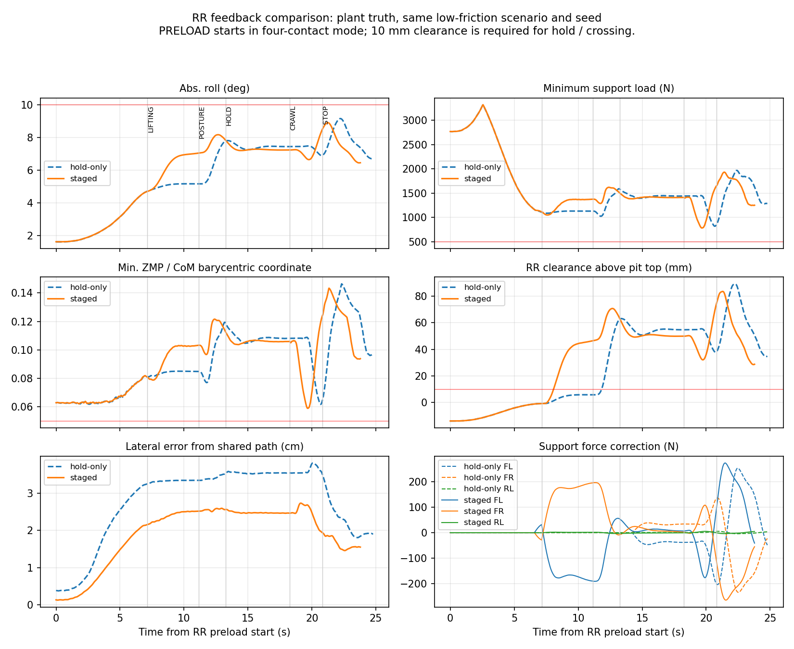

# 卸载末段、抬升与保持的分阶段反馈

## 本轮实现范围

在已发布的可选在线三支撑分配上增加 `--support-allocation-transitions`；标称与 μ=0.6/近起点使用各自经过哈希核验的辨识文件。新增 `--average-path-reference`，用 INIT_SETTLE 最后 1 s、20 ms 采样的窗口平均位置和航向作为 FR/RR 共用参考。两项默认关闭，便于保留原对照。

经典前馈、轮载反馈、约束分配、姿态阻尼、速度 PI 和方向反馈继续组合工作，不用 AI/RL、完整 MPC/WBC，不修改车型质量或载荷位置。阶段不同，目标与适用判据也不同：

| 阶段 | 本轮反馈 / 参考 | 适用门槛 |
|---|---|---|
| INIT_SETTLE | 累积末1 s路径观测，现有初始化通过后冻结平均参考 | 原有初始化门槛；平均器不增加逐样本静稳检查 |
| PRELOAD 初中段 | 现有轮载反馈、参考时钟及前馈 | 新三支撑 QP 等待接触条件，不套用离地净空 |
| PRELOAD 末段 | 轮载接近零且三角形已安全时，协同修正三个支撑悬架；四接地/三接地局部增益按载荷混合 | 抬起轮≤原ready载荷100 N，三支撑≥500 N，CoM与准静态ZMP λ≥0.05 |
| LIFTING | 已知抬轮力与耦合保持原接口；三个支撑悬架持续反馈；FR按当前姿态与角速度阻尼，RR跟踪已有−7.2°姿态目标 | 预测净空允许从当前值开始逐步增加，不要求刚开始已达10 mm；支撑、姿态、行程约束继续 |
| RR_POSTURE | 跟踪原有−7.2°目标并阻尼，协同控制支持原有调姿动作 | 原有净空/姿态进入条件和4 s超时不变 |
| HOLD / CRAWL / STOP | RR保持−7.2°目标，FR冻结进入保持时的姿态；支撑QP、速度/方向反馈持续工作 | QP完整10 mm净空预测约束，实际过坑/停车按原几何判据；每轮保持≥5 s |
| LOWERING / RETURN / ABORT | 附加修正连续释放；RR实际力快照交接，外层不重复加力 | 原有固地停车及恢复规则；禁止坑上直接落轮 |

升轮过程中的预测净空下限为 `min(10 mm, 当前净空−2 mm)`。2 mm 为配置化的局部一步预测余量，允许轮胎从压缩接触状态开始转换；不替代离地确认。HOLD和过坑始终使用原实际轮载/净空/稳定点验收。卸载尚未接近完成时的协同四输入QP仍未替换现有反馈，不能称全程统一分配已经完成。

新增参数集中于 `config.py` 的 `SUPPORT_QP` 与 `PATH_REFERENCE`；混合载荷区间50–300 N，暂停后再次求解仍限制单个20 ms周期内的修正增量。上层安全点目标λ=0.075为软跟踪目标，预测硬下限λ=0.05；实测裕度无需达到0.075才算通过。全部真实验收由独立plant truth日志执行。

## 路径参考

旧参考只读初始化末一个带噪样本。低附着seed20261005的控制航向参考误差约0.0402°；平均51个INIT_SETTLE观测后误差约0.0011°。实际验收仍以无噪声原始路径为基准，没有移动验收线。

平均器只按初始化模式收集，不独立判断每个样本静稳；冻结发生在现有INIT_SETTLE→PRELOAD转换。当前研究场景车辆初始化静止；不能将该功能解释为运动状态下的定位估计器，也未处理航向跨±180°场景。原模型仍以接地点/CoM理想值输入，不新增感知。

## 实际发现并修复的问题

首个主动扩展试验 FR通过，但 RR调姿超时，任务FAIL并恢复四轮。原因不是门槛过紧：中性角速度阻尼配合维持当前轮载，抵消了本来需要发生的负横滚动作，RR姿态停在约−6.2°、净空约28 mm，未到既定目标。

修复为RR_LIFTING/RR_POSTURE跟踪已有−7.2°目标，回归测试先FAIL后PASS。仅修复调姿目标时完整循环PASS，但进入HOLD捕获了约−7.74°瞬态姿态，后续横滚峰值9.75°。继续修正HOLD参考为同一−7.2°，避免把过冲当作稳定目标，第二个回归先FAIL后PASS。最终标称横滚峰值9.10°，低附着8.90°。未放宽10°/8°姿态、4 s调姿超时、净空、三角形、轮载或保持要求。

## 同工况原生对照

| 工况 / 版本 | 结果 | 完整周期 s | RR横滚峰值 ° | RR最弱支撑 N | RR最小ZMP λ | RR坑上净空 mm | 共用路径最大横移 cm |
|---|---|---:|---:|---:|---:|---:|---:|
| 标称seed20261001，原保持阶段QP | PASS | 88.48 | 9.14 | 785 | 0.05885 | 48.52 | 2.18 |
| 标称，初始中性阻尼扩展 | FAIL，恢复四轮 | 不算正常循环 | — | — | — | — | 2.19（仅FR运动） |
| 标称，最终分阶段参考 | PASS | 87.52 | 9.10 | 777 | 0.05827 | 48.06 | 2.19 |
| μ0.6/近起点seed20261005，原保持阶段QP | PASS | 87.58 | 9.15 | 822 | 0.06170 | 48.41 | 3.81 |
| 同工况，仅平均路径参考 | PASS | 87.58 | 9.16 | 821 | 0.06162 | 48.42 | 3.62 |
| 同工况，最终分阶段参考+平均路径 | PASS | 86.58 | 8.90 | 786 | 0.05893 | 43.24 | 2.73 |

周期约缩短1 s，来自更早达到RR姿态/净空进入条件；动作轨迹时间、5 s保持和恢复时间没有缩短。低附着横移/横滚改善，但最弱轮载和稳定裕度稍下降，仍满足≥500 N/λ≥0.05，不能称所有指标都更优。仅平均参考的改善较小，主要性能变化来自阶段目标协同，而非单独平均化。

最终两个工况所有分配求解OPTIMAL，无连续失败；上下层合计求解p95约2.51/3.37 ms，最大3.67/5.84 ms，本机观测不等于多任务负载下硬实时保证。FR最低坑上净空约34.8/34.2 mm；三支撑最弱轮载约700/711 N，较之前略有变化，仍通过。



图中红线为三接地阶段对应门槛，PRELOAD开始时仍有四轮接触；灰线标示新版本阶段边界。两个版本各自按RR预载开始对齐，不能把较早完成的阶段理解为相同时刻的相同接触状态。

## 中止恢复及测试

低附着新配置在RR_HOLD后1 s注入坑前中止，任务FAIL、恢复PASS，实际悬架力快照交接跳变0 N；之后单个20 ms记录间最大力变化20.51 N，最终四轮恢复。该验证没有覆盖坑上故障、支撑丢失或任意传感器失效。

311项Python测试通过，包括新初始化平均、采样去重/冻结、过渡净空门槛、姿态参考、暂停后修正速率及原有恢复测试。日志增加实际使用的QP净空下限、带阻尼姿态目标和接触增益混合权重；这些字段在后续恢复试验中已有记录，较早的成功试验保存了配置与阶段计数但未记录新诊断列。

## 复现与版本范围

标称完整循环：

```powershell
$env:PYTHONPATH='src'
python scripts/run_right_side_full_cycle.py --output runs/staged_recheck --efficiency-profile compact --lateral-ride-scale 0 --rear-control-profile robust --front-steering-feedback --front-target-speed-kph 3.4 --front-min-pit-speed-kph 3 --front-brake-lead-m 0.5 --rear-target-speed-kph 3.35 --rear-min-pit-speed-kph 3 --measurement-noise --noise-seed 20261001 --average-path-reference --support-allocation active --support-allocation-transitions --support-allocation-gains evidence/static_fr_ii/support_allocation_gains_20261003.json
```

低附着复核：换输出目录与seed20261005，加`--road-friction 0.6 --vehicle-start-offset-m 0.3`，增益换为`support_gains_mu06_close_20261004.json`。不传旧`--contact-gain-bundle`。

恢复复核将入口替换为`run_rear_recovery_trial.py`并加`--abort-phase RR_HOLD`。精简证据导出与曲线入口分别为`export_support_allocation_evidence.py`和`plot_support_transition_evidence.py`；后者校验相同车型、工况和噪声种子才允许对照。

下一步仍是补齐卸载初中段的适用局部模型与协同分配、验证姿态/外扰及反馈延迟，以及按几何位置设计坑上异常处理。当前两工况不能当作任意车辆/载荷/附着泛化，也未验证4–7 km/h。
